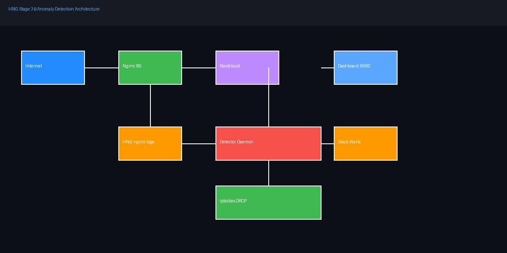

# HNG Stage 3 — Anomaly Detection Engine

This is a real-time traffic anomaly detector I built for HNG Stage 3. It sits next to Nginx, watches every incoming request, learns what normal looks like, and automatically blocks IPs that go way beyond that — no manual intervention needed.

**Live dashboard:** http://meseret-hng.servequake.com/dashboard/
**Server IP:** 35.223.71.226
**Language:** Python

---

## The idea

Most rate limiters work with fixed thresholds — block anyone over 100 req/s, for example. The problem is that "normal" traffic varies a lot depending on the time of day and what users are doing. A fixed threshold either lets real attacks through during quiet hours or blocks legitimate users during busy ones.

This tool learns your traffic patterns on the fly. It builds a rolling baseline from the last 30 minutes of real traffic, then flags anything that spikes more than 3 standard deviations above that — or more than 5x the mean. When something looks wrong, it drops the IP at the firewall level with an iptables rule and sends a Slack alert.

---

## Architecture

```
Internet → Nginx (port 80) → Nextcloud
                ↓
         HNG-nginx-logs (named Docker volume)
                ↓
         Detector daemon (Python)
                ↓
         ┌──────────────────────────────┐
         │  monitor.py  → tail log      │
         │  window.py   → sliding deque │
         │  baseline.py → rolling mean  │
         │  detector.py → z-score check │
         │  blocker.py  → iptables DROP │
         │  notifier.py → Slack alerts  │
         │  dashboard.py → Flask UI     │
         │  audit.py    → audit log     │
         └──────────────────────────────┘
```



---

## How it works

### Watching the log

The detector tails `/var/log/nginx/hng-access.log` line by line as requests come in. For each request it records the source IP, whether it was an error (status >= 400), and the timestamp.

### Sliding windows

Every IP gets its own sliding window — a deque of `(timestamp, is_error)` tuples covering the last 60 seconds. There's also a global window for all traffic combined. Old entries fall off the left side automatically on every read. Rate = `len(deque) / 60`. No external libraries — pure Python deques.

### Baseline

Every second, the current global request count gets pushed into a 30-minute rolling deque. Every 60 seconds, mean and standard deviation are recalculated from that window. If the current hour has enough data (≥10 samples), the hourly average is used instead — this handles predictable daily patterns better. The floor is 1.0 req/s so the system doesn't overreact during genuinely quiet periods.

### Detection

Two checks run on every request:

- **Z-score check:** if `(ip_rate - mean) / stddev > 3.0` → ban
- **Multiplier check:** if `ip_rate > mean × 5` → ban

If an IP also has a high error rate (lots of 4xx/5xx), both thresholds are cut in half — a scanner probing for vulnerabilities gets caught faster.

Global traffic spikes trigger a Slack alert but don't result in a ban, since you can't block "everyone."

### Bans and unbans

Bans are iptables DROP rules applied immediately (within 10 seconds of detection). They expire on a backoff schedule:

1. First ban: 10 minutes
2. Second offence: 30 minutes
3. Third offence: 2 hours
4. After that: permanent

Everything — bans, unbans, rebans — gets written to an audit log at `/var/log/detector/audit.log`.

### Dashboard

A Flask app serves the live dashboard at `http://meseret-hng.servequake.com/dashboard/`. It refreshes every 3 seconds and shows: global req/s, baseline mean/stddev, top 10 source IPs, currently banned IPs with condition/rate/baseline/duration, CPU/memory usage, and uptime.

---

## Stack

| Component | What it does |
|-----------|-------------|
| Nginx | Reverse proxy in front of Nextcloud, writes JSON access logs |
| Nextcloud | The app being protected (accessible by IP only) |
| Detector | Python daemon — tails logs, runs detection, manages bans |
| Dashboard | Flask UI served through Nginx at `/dashboard/` |

---

## Setup — fresh VPS to fully running stack

**1. Clone the repo**
```bash
git clone https://github.com/meseretak/hng-stage3.git
cd hng-stage3
```

**2. Configure environment**
```bash
cp .env.example .env
```
Edit `.env`:
```
SLACK_WEBHOOK_URL=https://hooks.slack.com/services/your/webhook/url
SERVER_IP=your.server.ip
```

**3. Install Docker and Docker Compose**
```bash
curl -fsSL https://get.docker.com | sh
sudo usermod -aG docker $USER
```

**4. Switch iptables to legacy mode (required for Docker + detector)**
```bash
sudo update-alternatives --set iptables /usr/sbin/iptables-legacy
sudo update-alternatives --set ip6tables /usr/sbin/ip6tables-legacy
```

**5. Open firewall ports**
```bash
sudo ufw allow 22/tcp
sudo ufw allow 80/tcp
sudo ufw enable
```

**6. Start everything**
```bash
docker compose up -d --build
```

**7. Verify**
```bash
docker compose ps
curl http://localhost/api/status
```

---

## Tuning

All thresholds live in `detector/config.yaml`:

```yaml
zscore_threshold: 3.0          # stddevs above baseline = ban
rate_multiplier_threshold: 5.0 # times the mean = ban
error_rate_multiplier: 3.0     # tightening factor for high-error IPs
unban_schedule: [10, 30, 120]  # ban durations in minutes
baseline_window_minutes: 30    # rolling window size
baseline_floor_rps: 1.0        # minimum baseline to prevent over-sensitivity
```

---

## Repo layout

```
detector/
  main.py        entry point — wires all modules
  monitor.py     tails and parses the Nginx JSON log
  window.py      deque-based sliding window per IP and global
  baseline.py    rolling 30-min baseline with hourly slots
  detector.py    z-score and multiplier detection logic
  blocker.py     iptables DROP rules and ban state
  unbanner.py    background thread for backoff unbanning
  notifier.py    Slack webhook alerts
  dashboard.py   Flask live metrics UI
  audit.py       structured audit log writer
  config.py      loads config.yaml
  config.yaml    all thresholds and settings
  requirements.txt
  Dockerfile
nginx/
  nginx.conf     JSON logging + X-Forwarded-For + dashboard proxy
docs/
  architecture.png
  blog-post.md
  screenshots/
    Tool-running.png
    Ban-slack.png
    Unban-slack.png
    Global-alert-slack.png
    Iptables-banned.png
    Audit-log.png
    Baseline-graph.png
docker-compose.yml
.env.example
```

---

## Screenshots

| Screenshot | Description |
|---|---|
|  | Daemon running, processing log lines |
|  | Slack ban notification |
|  | Slack unban notification |
|  | Slack global anomaly notification |
|  | iptables -L -n showing blocked IP |
|  | Structured audit log entries |
|  | Baseline over time with two hourly slots |

---

## Blog post

https://dev.to/meseret_akalu_1743b6f6aa5/devops-track-3-4-20l2

## Repo

https://github.com/meseretak/hng-stage3
